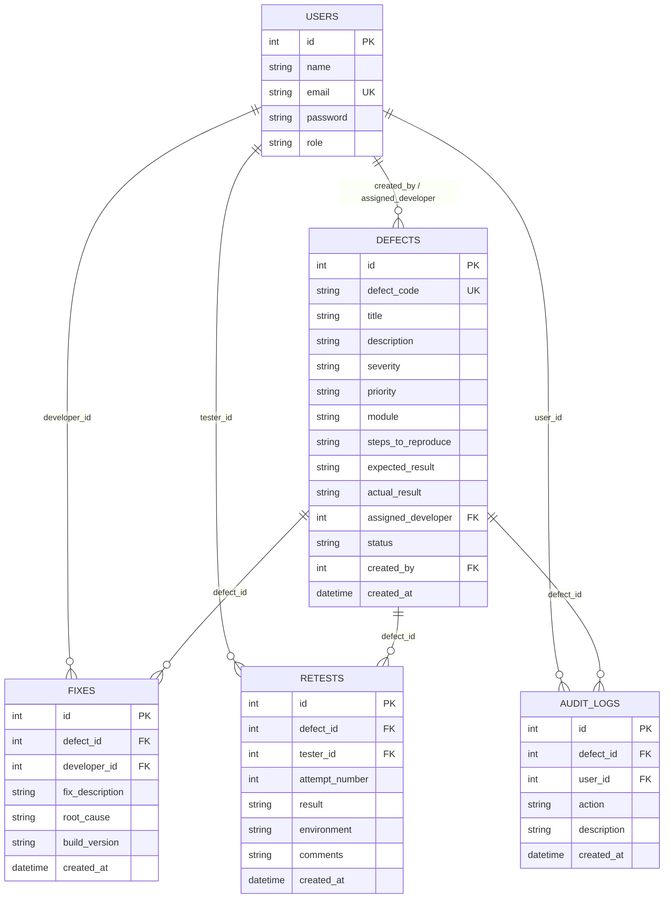

# Software Defect Re-Test Execution Logger

[](https://defect-retest-logger.onrender.com)
[](https://nodejs.org)
[](https://react.dev)
[](https://vitejs.dev)
[](https://www.sqlite.org)

> **Live Production Deployment**: [https://defect-retest-logger.onrender.com](https://defect-retest-logger.onrender.com)

A robust, full-stack web application designed and developed for a **Software Engineering & Quality Assurance (SE/QA)** college capstone project. It implements a complete, structured defect tracking and re-test execution lifecycle — from initial defect reporting to developer fix submission, multi-attempt QA verification, and QA Lead closure approval with immutable audit logs.

---

## 🚀 Key Highlights & Capabilities

- 🛡️ **Strict 3-Role Authorization**: Independent workspaces for **QA Tester**, **Developer**, and **QA Lead** with route guards, dedicated navbars, and JWT-authenticated backend validation.
- 🔒 **Developer Workload Isolation**: Developers strictly see defects assigned to their account. Cross-developer data access is blocked at both API and UI layers.
- 🔄 **Sequential Attempt Tracking**: Automatically tracks and increments `Attempt #1`, `Attempt #2`, `Attempt #3`, etc., on each re-test cycle.
- 📜 **Immutable Audit Trail**: Every status change (Creation, Fix Submission, Re-Test PASS/FAIL, Closure Approval) creates a timestamped audit log.
- 📊 **Real-Time Dashboards**: Metrics for Total Defects, Open, Ready for Re-Test, Reopened, Pending Closure, and Closed.
- ⚡ **Native SQLite Engine**: Built on Node's native `node:sqlite` (`DatabaseSync`), offering zero-dependency persistence, WAL mode, and foreign key integrity.
- 💡 **One-Click Demo Account Switching**: Quick-login chips on the login screen for instant presentation demos.
- ☁️ **Render Ready**: Includes production static SPA serving, `render.yaml` blueprint, and `.node-version` for instant 1-click cloud deployment.

---

## 👥 User Roles & Permission Matrix

| Feature / Action | QA Tester | Developer | QA Lead |
| :--- | :---: | :---: | :---: |
| **Role Dashboard & Metrics** | ✅ | ✅ | ✅ |
| **Report New Defect (`BUG-XXXX`)** | ✅ | ❌ | ❌ |
| **View Complete Defect Directory** | ✅ | ❌ (Assigned only) | ✅ |
| **View Assigned Defects Only** | ❌ | ✅ | ❌ |
| **Submit Fix (Root Cause & Build Version)** | ❌ | ✅ | ❌ |
| **Execute Re-Test (PASS / FAIL)** | ✅ | ❌ | ❌ |
| **Approve Final Defect Closure (`CLOSED`)** | ❌ | ❌ | ✅ |
| **View Audit Trail & Re-Test History** | ✅ | ✅ (Assigned only) | ✅ |

---

## 🔄 Defect Lifecycle State Machine

```
              [ QA Tester Reports Defect ]
                           │
                           ▼
                        ┌──────┐
                        │ OPEN │
                        └──────┘
                           │
               [ Developer Submits Fix ]
                           │
                           ▼
                ┌───────────────────┐
                │ READY_FOR_RETEST  │
                └───────────────────┘
                           │
              [ QA Tester Re-Tests Defect ]
                     ┌─────┴─────┐
             ( FAIL )            ( PASS )
                │                   │
                ▼                   ▼
          ┌──────────┐    ┌─────────────────┐
          │ REOPENED │    │ PENDING_CLOSURE │
          └──────────┘    └─────────────────┘
                │                   │
   [ Dev Submits Fix #2 ]  [ QA Lead Sign-Off ]
                │                   │
                └─────────► ┌──────────────┐
                            │    CLOSED    │
                            └──────────────┘
```

### State Definitions
1. `OPEN`: Newly reported defect awaiting developer investigation.
2. `IN_PROGRESS`: Developer is actively debugging and writing a fix.
3. `READY_FOR_RETEST`: Developer committed a fix, documented root cause, and provided a build version.
4. `REOPENED`: QA Tester executed a re-test and marked it `FAIL` (attempt counter increments).
5. `PENDING_CLOSURE`: QA Tester executed a re-test and marked it `PASS`.
6. `CLOSED`: QA Lead inspected verification evidence and approved final closure.

---

## 🔑 Demo Login Credentials

The SQLite database auto-seeds the following demo accounts on startup:

| Role | Email | Password | Access Scope |
| :--- | :--- | :--- | :--- |
| **QA Tester** | `qa@test.com` | `123456` | Logs defects, views all defects, executes re-tests |
| **Developer 1** | `developer@test.com` | `123456` | Alex Rivera — Submits fixes for assigned bugs |
| **Developer 2** | `developer2@test.com` | `123456` | David Chen — Second developer for isolation testing |
| **QA Lead** | `lead@test.com` | `123456` | Elena Vance — Reviews PASS evidence and grants final sign-off |

---

## 🛠️ Technology Stack

- **Frontend**:
  - React 18
  - Vite 6 (Fast build tool & development server)
  - React Router DOM v6 (Client-side routing & protected guards)
  - Lucide React (Icons)
  - Vanilla CSS (Modern clean design system with responsive layouts)
- **Backend**:
  - Node.js (v22.x LTS)
  - Express.js
  - JSON Web Tokens (`jsonwebtoken`) for bearer authentication
  - CORS middleware
- **Database**:
  - SQLite (Native `node:sqlite` engine with foreign key enforcement and WAL mode)
- **Deployment**:
  - Render Cloud Platform (Unified Full-Stack Web Service)

---

## 🗄️ Database Schema



---

## ☁️ Deployment on Render

This repository is pre-configured for **Render** with static SPA serving, `render.yaml`, and `.node-version`.

### Method A: 1-Click Render Blueprint (Recommended)
1. Go to **[Render Dashboard](https://dashboard.render.com/)** and click **New +** → **Blueprint**.
2. Connect this repository: `https://github.com/vivek-kothekar/software-defect-retest-logger`.
3. Click **Apply**. Render will automatically configure Node 22, run `npm run build`, and start the app.

### Method B: Manual Web Service Setup
1. In Render, click **New +** → **Web Service** and select this repository.
2. Set the configuration:
   - **Language**: `Node`
   - **Build Command**: `npm run build`
   - **Start Command**: `npm start`
   - **Environment Variables**:
     - `NODE_VERSION` = `22.14.0`
     - `JWT_SECRET` = *(any random secure key)*
3. Click **Deploy Web Service**.

---

## 💻 Local Development Setup

### Prerequisites
- **Node.js** `>= 22.5.0` (required for native `node:sqlite`)
- **npm** `>= 10.0.0`

### Quick Start (Windows)
Double-click [`start.bat`](start.bat) in the project root to install dependencies and run both servers concurrently.

### Manual Setup

1. **Clone the repository**:
   ```bash
   git clone https://github.com/vivek-kothekar/software-defect-retest-logger.git
   cd software-defect-retest-logger
   ```

2. **Install all dependencies**:
   ```bash
   npm run build
   ```

3. **Start the development servers**:
   - **Backend API** (Terminal 1):
     ```bash
     npm run start:backend
     ```
     *Runs on `http://localhost:5000`*

   - **Frontend UI** (Terminal 2):
     ```bash
     npm run start:frontend
     ```
     *Runs on `http://localhost:3000`*

4. Open your browser and navigate to: **`http://localhost:3000`**

---

## 🧪 Step-by-Step Viva Presentation Demonstration

To walk through the complete defect lifecycle during a project viva or review:

1. **Report Defect (QA Tester)**:
   - Log in with `qa@test.com` / `123456`.
   - Click **Report Defect**, enter bug details, assign to **Alex Rivera (Developer 1)**, and submit.
   - Status is set to **`OPEN`** (`BUG-1001`).
2. **Submit Code Fix (Developer)**:
   - Log in with `developer@test.com` / `123456`.
   - Go to **Assigned Defects**, open `BUG-1001`, and enter:
     - **Root Cause**: `Unchecked null state in event listener`
     - **Build Version**: `v1.0.1`
     - **Fix Description**: `Added defensive check and safe fallback handling`
   - Click **Submit Fix**. Status changes to **`READY_FOR_RETEST`**.
3. **Execute Re-Test Attempt #1 (QA Tester - FAIL)**:
   - Log back in as `qa@test.com`.
   - Go to **Re-Test Queue**, open `BUG-1001`, select **FAIL**, and enter notes: `Issue still reproduces under slow network simulation`.
   - Status updates to **`REOPENED`** (Attempt #1 recorded).
4. **Submit Fix #2 (Developer)**:
   - Developer logs in, sees defect reopened, and submits build `v1.0.2` with async handling fix.
   - Status moves to **`READY_FOR_RETEST`**.
5. **Execute Re-Test Attempt #2 (QA Tester - PASS)**:
   - QA Tester re-tests build `v1.0.2`, selects **PASS**, and leaves verification notes.
   - Status moves to **`PENDING_CLOSURE`** (Attempt #2 recorded).
6. **Final Closure Sign-Off (QA Lead)**:
   - Log in with `lead@test.com` / `123456`.
   - Go to **Closure Approvals**, verify the PASS re-test evidence and tester comments, and click **Approve Final Closure**.
   - Defect status reaches final state **`CLOSED`**.
7. **Inspect Audit Trail**:
   - Open the defect details page to view the complete history: 2 code fix submissions, 2 re-test attempts, and the complete audit timeline.

---

## 📁 Repository Structure

```
software-defect-retest-logger/
├── .node-version             # Specifies Node.js 22.14.0 for Render
├── render.yaml               # Render Cloud Blueprint definition
├── package.json              # Monorepo build and start scripts
├── start.bat                 # Windows one-click local launcher
├── backend/
│   ├── database/
│   │   ├── db.js             # Native SQLite DatabaseSync connection
│   │   └── init.js           # Schema creation & demo user seeder
│   ├── middleware/
│   │   └── auth.js           # JWT verification & role authorization
│   ├── routes/
│   │   ├── auth.js           # Login, user profiles & developer lists
│   │   ├── defects.js        # Defect CRUD, stats & role-filtered queries
│   │   ├── fixes.js          # Developer fix submissions
│   │   ├── retests.js        # QA re-test queue & attempt logger
│   │   └── closures.js       # QA Lead closure approval workflow
│   ├── server.js             # Express application & SPA static server
│   ├── test-backend.js       # API unit test script
│   └── test-e2e-all.js       # End-to-end automated test runner
└── frontend/
    ├── index.html            # HTML entry point
    ├── vite.config.js        # Vite build configuration & proxy
    └── src/
        ├── App.jsx           # Application routing & role guards
        ├── main.jsx          # React DOM root entry
        ├── styles.css        # Modern design system & UI tokens
        ├── context/
        │   └── AuthContext.jsx # Global user authentication state
        ├── services/
        │   └── api.js        # Centralized HTTP client wrapper
        ├── components/
        │   ├── Header.jsx    # Top navigation & user profile dropdown
        │   ├── Sidebar.jsx   # Role-specific navigation menus
        │   ├── StatusBadge.jsx # Dynamic defect status badges
        │   └── AuditTimeline.jsx # Visual audit trail timeline
        └── pages/
            ├── Login.jsx     # Auth page with quick demo account chips
            ├── qa/           # QA Tester pages (Dashboard, Create, List, Retest)
            ├── developer/    # Developer pages (Dashboard, Assigned Defects)
            └── lead/         # QA Lead pages (Dashboard, Closure Approvals)
```

---

## 👨‍💻 Project Information

- **Course**: Software Engineering & Quality Assurance (SE/QA)
- **Project**: Software Defect Re-Test Execution Logger
- **Architecture**: REST API + React SPA + Native SQLite Engine
- **Live URL**: [https://defect-retest-logger.onrender.com](https://defect-retest-logger.onrender.com)
- **Repository**: [github.com/vivek-kothekar/software-defect-retest-logger](https://github.com/vivek-kothekar/software-defect-retest-logger)
